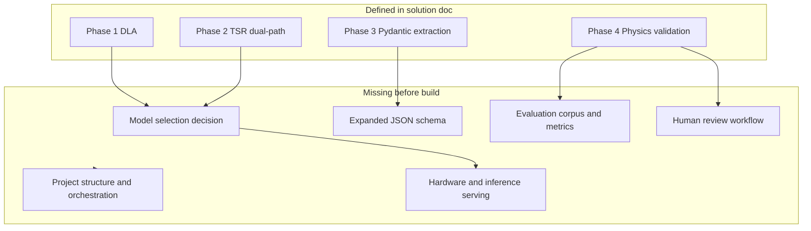
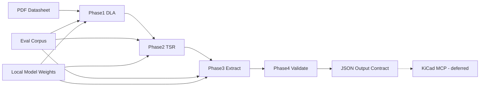

# Problem 1 Assessment Plan (Air-Gapped, P1-Only)

## Context

The repo currently contains only two documents — no code, tests, or sample data:

- [objectives.md](objectives.md) — six formal problem statements for an AI-driven EDA system
- [problem_1_solution.md](problem_1_solution.md) — a 4-phase hybrid multimodal pipeline for datasheet parsing

**Scope locked:** Problem 1 only (datasheet → structured JSON). **Deployment locked:** air-gapped / on-prem — no cloud APIs (rules out Gemini 1.5 Pro and similar).

---

## 1. Alignment Assessment: Objectives vs Solution Doc

### What aligns well

| Objective 1 requirement | Solution doc coverage |
|---|---|
| Extract tabular data from heterogeneous PDF datasheets | Phases 1–2 (DLA + TSR) directly address this |
| Machine-readable JSON output | Phase 3 Pydantic schema (`ComponentDatasheet`, `ElectricalParameter`) |
| Handle inconsistent TI-style formatting | Dual-path TSR (vector + VLM) with confidence scoring |
| Defense-grade accuracy | Phase 4 physics validation + confidence metadata flow |
| Downstream CAD consumption | Routing logic to KiCad MCP (interface only for P1 scope) |

### Gaps — objectives not fully covered in solution doc

These must be resolved **before** implementation planning:

1. **Pinout extraction** — objectives explicitly list pinouts; solution doc focuses on electrical-characteristics tables only. No schema for pin number, pin name, pin type, or alternate functions.
2. **Absolute maximum ratings** — listed alongside electrical characteristics in objectives; solution treats all tables generically. Abs-max tables need distinct validation rules (e.g., must not be confused with recommended operating conditions).
3. **Table type classification** — pipeline assumes "table → parameters" but does not classify *which* section a table belongs to (electrical chars vs abs max vs timing vs ordering).
4. **Multi-page / spanning tables** — common in TI datasheets; not addressed in DLA or TSR phases.
5. **Package / mechanical data** — not in objectives explicitly but often co-located; decide in/out of P1 scope.

### Intentional deferrals (OK for P1-only scope)

- **Problem 2 (pin nomenclature):** Phase 3 uses raw names like `V_CC` without normalization to universal net concepts. Acceptable for P1 if output schema preserves `raw_text` and defers normalization.
- **Problem 6 (KiCad MCP):** Solution routes validated JSON to MCP; for P1-only, define an **output contract** (JSON schema + file/API format) without building MCP integration.

---

## 2. Solution Doc Internal Gaps (Implementation Blockers)

The solution doc is architecturally sound but leaves these undefined:



### 2a. Model selection (air-gapped)

The doc lists multiple options per phase but picks none. For air-gapped, narrow to:

| Phase | Recommended starting point | Rationale |
|---|---|---|
| Phase 1 DLA | **YOLOv8 fine-tuned on DocLayNet** | Fast, deployable offline, good table/footnote detection |
| Phase 2 Path A | **pdfplumber + Camelot lattice** | No ML, deterministic when vector lines exist |
| Phase 2 Path B | **Qwen2-VL or LLaVA** (local weights) | Air-gapped VLM fallback for borderless tables |
| Phase 3 extraction | **Local LLM + Instructor/Pydantic** (e.g., Qwen2.5-7B-Instruct) | Structured JSON without cloud |
| Phase 1 alt | **Surya** (layout + OCR) | Worth a spike — may reduce model count |

**Assessment action:** Run a 3-datasheet spike comparing YOLOv8-DocLayNet vs Surya for table/footnote detection before committing.

### 2b. Schema expansion

Current schema in solution doc covers `ElectricalParameter` only. P1-complete schema needs:

```python
# Additional models required (not yet in solution doc)
class PinDefinition(BaseModel):
    pin_number: str
    pin_name: str
    pin_type: str              # power, ground, I/O, analog, NC
    alternate_functions: list[str]
    description: Optional[str]

class AbsoluteMaxRating(BaseModel):
    name: str
    max_value: ExtractedValue
    conditions: Optional[str]

class DatasheetSection(BaseModel):
    section_type: Literal["electrical_characteristics", "absolute_maximum_ratings", "pinout", "other"]
    page_range: tuple[int, int]
    parameters: list[ElectricalParameter]  # or PinDefinition, etc.

class ComponentDatasheet(BaseModel):
    component_id: str
    manufacturer: str
    package: Optional[str]
  sections: list[DatasheetSection]
    pins: list[PinDefinition]
    validation: ValidationResult
```

### 2c. Evaluation framework (currently absent)

Without metrics, "defense-grade accuracy" is unverifiable. Define before coding:

- **Corpus:** 20–30 TI datasheets spanning logic ICs, regulators, MCUs (diverse table styles)
- **Ground truth:** Manually annotated JSON for 5 "golden" datasheets (100% human-verified)
- **Metrics per phase:**
  - Phase 1: table detection recall/precision, footnote linkage accuracy
  - Phase 2: cell-level accuracy vs ground-truth grid
  - Phase 3: field-level F1 on parameter names, values, units
  - Phase 4: false-positive / false-negative rate on validation rules
- **Acceptance threshold:** e.g., >= 95% field accuracy on golden set before downstream handoff

### 2d. Orchestration and project structure

Proposed layout to assess and adopt:

```
p1-parser/
├── src/
│   ├── phase1_dla/          # layout detection, cropping, footnote_map
│   ├── phase2_tsr/          # vector path, vlm path, confidence scorer
│   ├── phase3_extract/      # unit normalization, instructor extraction
│   ├── phase4_validate/     # rule engine, routing logic
│   ├── schemas/             # pydantic models (single source of truth)
│   └── pipeline.py          # orchestrator CLI
├── models/                  # local model weights (gitignored)
├── corpus/                  # test PDFs + ground truth JSON
├── eval/                    # evaluation scripts and reports
├── configs/                 # thresholds, canonical units, sanity ranges
└── pyproject.toml
```

### 2e. Human review workflow

Solution doc mentions `review_required` flag but not the workflow:

- Where flagged records are stored (SQLite? JSON sidecar?)
- Review UI or CLI for engineers to correct and approve
- Whether corrected data feeds back into fine-tuning (future)

### 2f. Hardware requirements

Air-gapped inference needs explicit sizing:

- **Minimum:** CPU-only for vector path + small models (slow VLM)
- **Recommended:** 1x GPU (16–24 GB VRAM) for Qwen2-VL 7B + YOLOv8 concurrent
- **Packaging:** Docker image with all weights baked in for air-gapped transfer

---

## 3. Phase-by-Phase Readiness Checklist

### Phase 1: Document Layout Analysis

| Item | Status | Action needed |
|---|---|---|
| Rasterization (pdf2image, 300 DPI) | Specified | Confirm Poppler dependency in air-gapped install |
| Table detection model | Options listed, none chosen | Spike: YOLOv8-DocLayNet vs Surya |
| Footnote detection + linkage | Designed (`footnote_map`) | Prototype superscript regex + spatial matching |
| Section type classification | **Missing** | Add classifier: table crop → section type label |
| Multi-page table stitching | **Missing** | Design page-overlap merge logic |

### Phase 2: Table Structure Recognition

| Item | Status | Action needed |
|---|---|---|
| Vector path (pdfplumber/Camelot) | Specified | Implement + test on bordered tables |
| VLM path (local) | Specified generically | Select model (Qwen2-VL), design markdown-table prompt |
| Parallel execution + confidence scorer | Designed (`pick_best_grid`) | Implement `score_grid` heuristics concretely |
| Merged cell handling | **Missing** | Define matrix representation for colspan/rowspan |
| Empty cell / header row detection | **Missing** | Add to confidence scorer |

### Phase 3: Constrained Semantic Extraction

| Item | Status | Action needed |
|---|---|---|
| Pydantic schema | Partial (electrical only) | Expand for pinouts, abs max, sections |
| Unit normalization (`CANONICAL_UNITS`) | Designed, logic stubbed | Implement full conversion table (mV→V, µA→mA, kΩ→Ω, etc.) |
| Instructor + local LLM | Tools named | Wire to local inference server (vLLM/ollama) |
| Footnote injection into values | Designed (`footnote` field) | Connect Phase 1 `footnote_map` to Phase 3 input |
| Table-type-aware prompts | **Missing** | Different extraction prompts per section type |

### Phase 4: Physics Validation

| Item | Status | Action needed |
|---|---|---|
| Min/typ/max ordering | Code sample provided | Implement |
| Cross-parameter rules (`ELECTRICAL_RULES`) | Sample provided (has typo: `lambdavih`) | Fix and expand rule set |
| Sanity ranges (`SANITY_RANGES`) | Sample provided | Expand per component family |
| Abs-max-specific rules | **Missing** | e.g., V_CC abs max > recommended operating V_CC max |
| Routing logic (pass/warn/block) | Designed | Implement with configurable thresholds |
| Confidence threshold | Mentioned (0.85 example) | Make configurable in `configs/` |

---

## 4. Dependency and Risk Assessment



### Top risks for air-gapped P1

| Risk | Impact | Mitigation |
|---|---|---|
| VLM hallucination on borderless tables | Wrong component specs → bad PCB | Dual-path + confidence scoring + Phase 4 validation |
| Footnote linkage failure | Silent constraint loss | Flag unlinked superscripts as `review_required` |
| Unit normalization edge cases (µ vs u, mA vs A) | 1000x errors | Regex normalization + sanity ranges |
| No cloud retry on failure | Stuck on bad extraction | Human review queue + re-run Phase 2/3 locally |
| Model weight transfer to air-gapped env | Deployment blocker | Docker image with baked weights; document transfer procedure |
| TI datasheet format drift | Accuracy drops over time | Eval corpus with versioned re-runs |

---

## 5. Recommended Sequence to Build the Implementation Plan

This assessment should be completed in order before writing code:

1. **Finalize P1 scope boundary** — confirm pinouts and abs-max are in; package/mechanical data out
2. **Expand JSON schema** — single Pydantic module covering all P1 output types
3. **Curate evaluation corpus** — 5 golden + 25 test PDFs with ground truth
4. **Run model spike** (3 PDFs) — YOLOv8 vs Surya for DLA; Camelot vs Qwen2-VL for TSR
5. **Define output contract** — JSON schema file + example output for downstream KiCad MCP (no MCP code)
6. **Lock hardware profile** — GPU spec, Docker base image, offline install procedure
7. **Write implementation plan** — phased delivery with acceptance criteria per phase tied to eval metrics

---

## 6. Deliverables from This Assessment

Once the above actions are done, the **implementation plan** should contain:

- Frozen model choices per phase (air-gapped)
- Complete Pydantic schema (including pinouts, abs max, sections)
- Eval corpus with golden ground truth and metric thresholds
- Project structure and orchestration design
- Phase-by-phase milestones with pass/fail criteria
- JSON output contract for future KiCad MCP integration
- Human review workflow spec
- Docker/offline deployment runbook

**Not in P1 implementation plan:** Problems 2–5, KiCad MCP server code, knowledge graph, block diagram CV, netlist synthesis.
