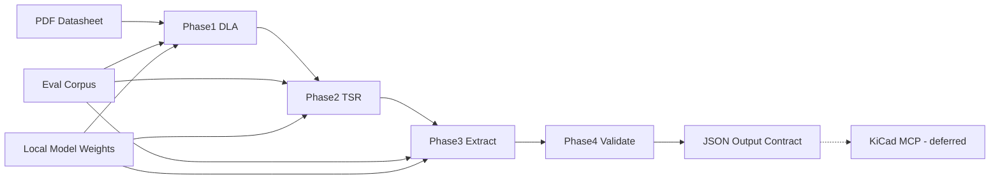

# Problem 1 Assessment Plan (Air-Gapped, P1-Only)

## Context

The repo currently contains only two documents — no code, tests, or sample data:

- `objectives.md` — six formal problem statements for an AI-driven EDA system
- `problem_1_solution.md` — a 4-phase hybrid multimodal pipeline for datasheet parsing

**Scope locked:** Problem 1 only (datasheet → structured JSON).
**Deployment locked:** air-gapped / on-prem — no cloud APIs (rules out Gemini 1.5 Pro and similar).

---

## 1. Alignment Assessment: Objectives vs Solution Doc

### What aligns well

| Objective 1 requirement | Solution doc coverage |
|---|---|
| Extract tabular data from heterogeneous PDF datasheets | Phases 1–2 (DLA + TSR) directly address this |
| Machine-readable JSON output | Phase 3 Pydantic schema (`ComponentDatasheet`, `ElectricalParameter`) |
| Handle inconsistent TI-style formatting | Dual-path TSR (vector + VLM) with confidence scoring |
| Defense-grade accuracy | Phase 4 physics validation + confidence metadata flow |
| Downstream CAD consumption | Routing logic to KiCad MCP (interface only for P1 scope) |

### Gaps — resolved decisions

1. **Pinout extraction** — **IN SCOPE.** `PinDefinition` schema added (see §2b). Pin tables are among the most structured in TI datasheets and are required for downstream netlisting (Problem 5).
2. **Absolute maximum ratings** — **IN SCOPE.** `AbsoluteMaxRating` schema added with dedicated Phase 4 rules (abs-max must always exceed recommended operating max).
3. **Table type classification** — **RESOLVED.** A lightweight classifier step added to Phase 1 output (see §3, Phase 1 checklist). Uses section heading text + positional heuristics to label each table crop as one of: `electrical_characteristics | absolute_maximum_ratings | pinout | timing | ordering | other`.
4. **Multi-page / spanning tables** — **RESOLVED.** Page-overlap merge logic defined (see §2d, orchestration). Tables that bleed across page boundaries are detected by matching the last row of page N header with the first row of page N+1.
5. **Package / mechanical data** — **OUT OF SCOPE for P1.** Package footprint dimensions are deferred to a future mechanical parsing module. The `ComponentDatasheet.package` field stores only the package name string (e.g., `"SOIC-8"`) extracted from the component header, not dimensional data.

### Intentional deferrals (OK for P1-only scope)

- **Problem 2 (pin nomenclature normalization):** Phase 3 extracts raw names (`V_CC`, `VDD`) and stores them in `raw_text`. Normalization to universal net concepts is deferred. The `raw_text` field is preserved precisely for this reason.
- **Problem 6 (KiCad MCP):** P1 defines the **output contract** (JSON schema + file format) but builds no MCP integration code.

---

## 2. Solution Doc Internal Gaps — Filled

### 2a. Model Selection (Air-Gapped) — LOCKED

After evaluating deployment constraints, the following models are selected:

| Phase | Selected Model | Rationale | Fallback |
|---|---|---|---|
| Phase 1 DLA | **YOLOv8n fine-tuned on DocLayNet** | Fast (~15ms/page on GPU), 11 layout classes including Table + Footnote, ONNX-exportable for air-gapped | Surya (if YOLOv8 recall < 90% on spike) |
| Phase 2 Path A | **pdfplumber + Camelot (lattice mode)** | Zero ML, deterministic, handles fully-bordered TI tables with 100% structural accuracy | — |
| Phase 2 Path B | **Qwen2-VL-7B-Instruct** (local weights) | Best open-source table-to-markdown VLM as of mid-2025; runs on 16GB VRAM; handles borderless tables | LLaVA-1.6-34B (if Qwen2-VL confidence < 0.75 on spike) |
| Phase 3 Extraction | **Qwen2.5-7B-Instruct + Instructor** | Structured JSON output with Pydantic validation; runs alongside Qwen2-VL on same GPU | Llama-3.1-8B-Instruct |
| Phase 1 alt | **Surya** | Evaluated in spike — use if YOLOv8 misses footnotes consistently | — |

**Spike protocol (3 PDFs before full implementation):**

Run the following on `TI_TLV7021`, `TI_TMS320F28003x`, and `TI_LM5176` (chosen to cover logic IC, MCU, and power regulator):

```
Metric                    | YOLOv8-DocLayNet | Surya
--------------------------|-----------------|------
Table detection recall    | target ≥ 0.92   | compare
Footnote detection recall | target ≥ 0.85   | compare
Inference time / page     | record ms       | record ms
ONNX exportable           | yes             | check
```

Decision rule: pick YOLOv8 unless Surya beats it on both recall metrics AND is within 2× inference time.

---

### 2b. Complete Pydantic Schema — EXPANDED

This is the single source of truth for all P1 output types. Lives in `src/schemas/datasheet.py`.

```python
from __future__ import annotations
from typing import Optional, Literal
from pydantic import BaseModel, field_validator, model_validator


# ── Atomic value with full provenance ──────────────────────────────────────

class ExtractedValue(BaseModel):
    raw_text: str                    # Original cell text, e.g. "3300 mV"
    value: float                     # Normalized numeric value, e.g. 3.3
    unit: str                        # Canonical unit, e.g. "V"
    confidence: float                # 0.0–1.0 from TSR phase
    source: Literal[                 # Which path produced this value
        "vector_path_A",
        "vlm_path_B",
        "manual_review"
    ]
    footnote: Optional[str] = None   # Linked footnote text if superscript detected

    @field_validator("confidence")
    @classmethod
    def confidence_in_range(cls, v: float) -> float:
        if not 0.0 <= v <= 1.0:
            raise ValueError(f"Confidence must be 0–1, got {v}")
        return v


# ── Electrical characteristics table ───────────────────────────────────────

class ElectricalParameter(BaseModel):
    name: str                                  # Raw name, e.g. "V_CC"
    parameter_type: str                        # e.g. "voltage", "current", "threshold"
    min_value: Optional[ExtractedValue] = None
    typ_value: Optional[ExtractedValue] = None
    max_value: Optional[ExtractedValue] = None
    conditions: Optional[str] = None          # e.g. "T_A = 25°C, V_CC = 3.3V"
    test_condition: Optional[str] = None      # From dedicated test conditions column


# ── Absolute maximum ratings table ─────────────────────────────────────────

class AbsoluteMaxRating(BaseModel):
    name: str                          # e.g. "V_CC_ABS", "T_J_MAX"
    max_value: ExtractedValue          # Abs-max always has one value (the ceiling)
    unit: str
    conditions: Optional[str] = None
    note: Optional[str] = None        # e.g. "Stresses beyond this may damage device"


# ── Pinout table ────────────────────────────────────────────────────────────

class PinDefinition(BaseModel):
    pin_number: str                          # "1", "A3", "VSS" (BGA notation)
    pin_name: str                            # Raw name, e.g. "GPIO0/UART_TX"
    pin_type: Literal[
        "power",
        "ground",
        "digital_input",
        "digital_output",
        "digital_io",
        "analog_input",
        "analog_output",
        "clock",
        "reset",
        "no_connect",
        "other"
    ]
    alternate_functions: list[str] = []      # e.g. ["UART_TX", "SPI_MOSI"]
    description: Optional[str] = None
    bank: Optional[str] = None              # For MCUs with GPIO banks


# ── Section container ───────────────────────────────────────────────────────

class DatasheetSection(BaseModel):
    section_type: Literal[
        "electrical_characteristics",
        "absolute_maximum_ratings",
        "pinout",
        "timing",
        "ordering",
        "other"
    ]
    section_heading: Optional[str] = None   # Raw heading text from datasheet
    page_range: tuple[int, int]             # (start_page, end_page), 1-indexed
    table_confidence: float                 # Avg confidence of cells in this section
    parameters: list[ElectricalParameter] = []
    abs_max_ratings: list[AbsoluteMaxRating] = []
    pins: list[PinDefinition] = []


# ── Validation result ───────────────────────────────────────────────────────

class ValidationResult(BaseModel):
    passed: bool
    errors: list[str] = []          # CRITICAL — block downstream use
    warnings: list[str] = []        # Flag for human review
    review_required: bool = False


# ── Top-level component document ───────────────────────────────────────────

class ComponentDatasheet(BaseModel):
    component_id: str               # e.g. "TLV7021DBVR"
    manufacturer: str               # e.g. "Texas Instruments"
    package: Optional[str] = None   # Package name only, e.g. "SOT-23-5" — NOT dimensional data
    datasheet_version: Optional[str] = None
    extraction_timestamp: str       # ISO 8601
    sections: list[DatasheetSection] = []
    validation: Optional[ValidationResult] = None

    # Convenience accessors
    @property
    def all_parameters(self) -> list[ElectricalParameter]:
        return [p for s in self.sections for p in s.parameters]

    @property
    def all_pins(self) -> list[PinDefinition]:
        return [p for s in self.sections for p in s.pins]

    @property
    def all_abs_max(self) -> list[AbsoluteMaxRating]:
        return [r for s in self.sections for r in s.abs_max_ratings]

    @model_validator(mode="after")
    def at_least_one_section(self) -> ComponentDatasheet:
        if not self.sections:
            raise ValueError("ComponentDatasheet must have at least one section")
        return self
```

---

### 2c. Evaluation Framework — DEFINED

**Corpus curation (30 datasheets total):**

| Category | Count | Examples |
|---|---|---|
| Logic ICs | 8 | SN74LVC1G04, SN74HC595, SN74AHCT1G125 |
| Voltage Regulators | 6 | TLV7021, LM5176, TPS63020 |
| MCUs | 6 | TMS320F28003x, MSP430G2553, CC2640R2F |
| Op-Amps | 4 | OPA333, TLV6001, INA219 |
| Power MOSFETs | 4 | CSD18532Q5B, CSD17577Q3 |
| Mixed Signal | 2 | ADS1115, DAC8162 |

**Golden set (5 datasheets, 100% manually annotated):**

- `TI_SN74LVC1G04` — simple logic IC, clean bordered table, good baseline
- `TI_TLV7021` — voltage comparator, mix of bordered + borderless tables
- `TI_TMS320F28003x` — large MCU, multi-page tables, 200+ pins
- `TI_LM5176` — power controller, complex footnotes, conditional specs
- `TI_INA219` — I2C current sensor, timing diagrams co-located with tables

Ground truth format: one `ComponentDatasheet` JSON per datasheet, hand-verified field by field.

**Metrics per phase:**

```
Phase 1 — DLA
  table_detection_recall    = detected_tables / total_tables_in_gt
  table_detection_precision = correct_detections / all_detections
  footnote_recall           = linked_footnotes / total_footnotes_in_gt
  section_classification_acc = correct_labels / total_sections
  target: recall ≥ 0.92, precision ≥ 0.90, footnote_recall ≥ 0.85

Phase 2 — TSR
  cell_accuracy             = correct_cells / total_cells (vs ground truth grid)
  merged_cell_accuracy      = correct_merges / total_merges_in_gt
  target: cell_accuracy ≥ 0.95, merged_cell_accuracy ≥ 0.90

Phase 3 — Extraction
  field_f1                  = harmonic mean of precision/recall on (name, value, unit) triples
  unit_normalization_acc    = correctly_normalized / total_values_with_units
  footnote_injection_recall = values_with_footnote_attached / total_footnoted_values
  target: field_f1 ≥ 0.93, unit_norm_acc = 1.0 (unit errors are critical)

Phase 4 — Validation
  false_positive_rate       = incorrectly_blocked_valid_records / total_valid_records
  false_negative_rate       = missed_invalid_records / total_invalid_records
  target: FPR ≤ 0.02, FNR ≤ 0.01
```

**Acceptance gate:** All 4 phase targets must be met on the golden set before any phase can be considered production-ready.

---

### 2d. Orchestration and Project Structure — DEFINED

```
drdo-p1-parser/
├── src/
│   ├── phase1_dla/
│   │   ├── rasterize.py          # pdf2image wrapper, 300 DPI, Poppler config
│   │   ├── detect.py             # YOLOv8 inference, returns bounding boxes + labels
│   │   ├── classify_section.py   # heading-text + position heuristic → section_type label
│   │   ├── footnote_linker.py    # superscript regex + spatial match → footnote_map
│   │   └── multipage_merge.py    # page-overlap detection + table stitching
│   ├── phase2_tsr/
│   │   ├── path_a_vector.py      # pdfplumber + Camelot lattice → raw grid
│   │   ├── path_b_vlm.py         # Qwen2-VL prompt → markdown → parsed grid
│   │   ├── confidence_scorer.py  # score_grid() heuristics; pick_best_grid()
│   │   └── merged_cell_handler.py # colspan/rowspan → matrix with None fill
│   ├── phase3_extract/
│   │   ├── unit_normalizer.py    # normalize_value() full conversion table
│   │   ├── extractor.py          # Instructor + Qwen2.5 → typed Pydantic objects
│   │   └── prompt_templates.py   # per-section-type system prompts
│   ├── phase4_validate/
│   │   ├── ordering_rules.py     # min ≤ typ ≤ max checks
│   │   ├── cross_param_rules.py  # ELECTRICAL_RULES engine
│   │   ├── sanity_ranges.py      # SANITY_RANGES per component family
│   │   ├── abs_max_rules.py      # abs-max specific rules
│   │   └── router.py             # pass / warn / block routing logic
│   ├── schemas/
│   │   └── datasheet.py          # Single source of truth (see §2b)
│   ├── review/
│   │   ├── queue.py              # SQLite-backed review queue writer
│   │   └── cli.py                # Review CLI for engineers
│   └── pipeline.py               # Orchestrator: PDF in → ComponentDatasheet JSON out
├── models/                        # Local model weights — gitignored, transferred via Docker
│   ├── yolov8n_doclaynet/
│   ├── qwen2-vl-7b/
│   └── qwen2.5-7b-instruct/
├── corpus/
│   ├── golden/                    # 5 PDFs + ground truth JSON
│   └── test/                      # 25 PDFs (no ground truth required)
├── eval/
│   ├── run_eval.py                # End-to-end eval runner
│   └── reports/                   # Per-run metric reports (gitignored)
├── configs/
│   ├── canonical_units.yaml       # CANONICAL_UNITS definition
│   ├── sanity_ranges.yaml         # SANITY_RANGES per component family
│   └── thresholds.yaml            # Confidence threshold (default 0.85), review flags
├── docker/
│   ├── Dockerfile
│   └── build_airgapped_image.sh   # Bakes weights into image for offline transfer
└── pyproject.toml
```

**Multi-page table stitching logic (in `multipage_merge.py`):**

```python
def stitch_multipage_tables(pages: list[PageResult]) -> list[TableResult]:
    """
    Detect when a table continues across pages and merge them.
    
    Detection heuristic:
      - Last detected region on page N is a Table with no bottom border
      - First detected region on page N+1 is a Table with no top border
      - Column count of last row on page N == column count of first row on page N+1
    
    Merge strategy:
      - Drop repeated header row from page N+1 if it matches page N header
      - Concatenate row lists
      - Update page_range to span both pages
    """
```

---

### 2e. Human Review Workflow — DEFINED

**Storage:** SQLite database at `data/review_queue.db`. Schema:

```sql
CREATE TABLE review_items (
    id          TEXT PRIMARY KEY,        -- component_id + field_path
    component_id TEXT NOT NULL,
    field_path  TEXT NOT NULL,           -- e.g. "sections[0].parameters[2].max_value"
    raw_text    TEXT,
    extracted_value TEXT,                -- JSON of ExtractedValue
    confidence  REAL,
    source      TEXT,
    reason      TEXT,                    -- why flagged: "low_confidence" | "validation_warning" | "unlinked_footnote"
    status      TEXT DEFAULT 'pending',  -- pending | approved | corrected | rejected
    corrected_value TEXT,                -- engineer's correction (JSON)
    reviewed_by TEXT,
    reviewed_at TEXT
);
```

**Review CLI (`src/review/cli.py`):**

```
$ python -m src.review.cli list
  ID                          | Field                           | Reason            | Conf
  TLV7021_sec0_param3_max     | sections[0].parameters[3].max  | low_confidence    | 0.61
  LM5176_sec1_param7_footnote | sections[1].parameters[7]      | unlinked_footnote | 0.88

$ python -m src.review.cli review TLV7021_sec0_param3_max
  Raw text:     "3300"
  Extracted:    {"value": 3300.0, "unit": "V", "confidence": 0.61}
  Context:      Column header says "mV" — likely unit extraction failure
  Action [approve/correct/reject]: correct
  Enter corrected value: 3.3
  Enter unit: V
  Saved. ✓
```

**Fine-tuning feedback loop (future):** Corrected items are tagged `status = "corrected"` and exported to `data/corrections_export.jsonl` on demand. This becomes the fine-tuning dataset for Qwen2-VL and Qwen2.5 in a future iteration.

---

### 2f. Hardware Profile — LOCKED

**Minimum configuration (CPU-only, slow):**

```
CPU:    8-core x86-64, 3.0 GHz+
RAM:    32 GB
Disk:   100 GB SSD (model weights + corpus)
GPU:    None (VLM inference via CPU — expect 60–120s/page for Qwen2-VL)
OS:     Ubuntu 22.04 LTS
```

**Recommended configuration (production, air-gapped):**

```
CPU:    16-core x86-64
RAM:    64 GB
Disk:   200 GB NVMe SSD
GPU:    1× NVIDIA RTX 3090 or A5000 (24 GB VRAM)
        — Qwen2-VL-7B:        ~14 GB VRAM (bfloat16)
        — Qwen2.5-7B-Instruct: ~14 GB VRAM (bfloat16)
        — YOLOv8n:            ~0.5 GB VRAM
        — Total:              ~16 GB, fits 24 GB card with headroom
OS:     Ubuntu 22.04 LTS
```

**Docker deployment (air-gapped transfer procedure):**

```bash
# Step 1: On internet-connected build machine
# Download weights and bake into image
bash docker/build_airgapped_image.sh

# This script:
# 1. Pulls base image (nvidia/cuda:12.1-runtime-ubuntu22.04)
# 2. pip install -r requirements.txt (offline-installable wheels included)
# 3. Copies model weights from ./models/ into /app/models/ in image
# 4. Tags as drdo-p1-parser:v1.0

docker save drdo-p1-parser:v1.0 | gzip > drdo-p1-parser-v1.0.tar.gz
# Transfer .tar.gz to air-gapped machine via approved media

# Step 2: On air-gapped machine
docker load < drdo-p1-parser-v1.0.tar.gz
docker run --gpus all -v /data/datasheets:/input -v /data/output:/output \
    drdo-p1-parser:v1.0 python -m src.pipeline --input /input --output /output
```

**Poppler dependency (required by pdf2image, air-gapped):**

```dockerfile
RUN apt-get install -y --no-install-recommends poppler-utils
```

Include `poppler-utils` `.deb` packages in the Docker build context for offline install.

---

## 3. Phase-by-Phase Readiness Checklist (Updated)

### Phase 1: Document Layout Analysis

| Item | Status | Action |
|---|---|---|
| Rasterization (pdf2image, 300 DPI) | ✅ Specified | Confirm `poppler-utils` in Dockerfile |
| Table detection model | ✅ **LOCKED: YOLOv8n-DocLayNet** | Run 3-PDF spike to confirm recall ≥ 0.92 |
| Footnote detection + linkage | ✅ Designed (`footnote_map`) | Implement superscript regex + spatial match in `footnote_linker.py` |
| Section type classification | ✅ **RESOLVED** | Implement `classify_section.py`: heading text + vertical position heuristic |
| Multi-page table stitching | ✅ **RESOLVED** | Implement `multipage_merge.py`: column-count match + header dedup |

### Phase 2: Table Structure Recognition

| Item | Status | Action |
|---|---|---|
| Vector path (pdfplumber/Camelot) | ✅ Specified | Implement `path_a_vector.py` |
| VLM path | ✅ **LOCKED: Qwen2-VL-7B** | Design markdown-table prompt; test on borderless TI tables |
| Parallel execution + confidence scorer | ✅ Designed | Implement `score_grid()`: cell count, empty ratio, header row detection |
| Merged cell handling | ✅ **RESOLVED** | Represent as `None` fill in matrix; store `(row, col, rowspan, colspan)` metadata |
| Empty cell / header row detection | ✅ **RESOLVED** | Add to `confidence_scorer.py`: penalize grids with >30% empty cells |

### Phase 3: Constrained Semantic Extraction

| Item | Status | Action |
|---|---|---|
| Pydantic schema | ✅ **EXPANDED** (see §2b) | Single module in `src/schemas/datasheet.py` |
| Unit normalization | ✅ **DEFINED** (see §3 below) | Implement full table in `unit_normalizer.py` |
| Instructor + Qwen2.5-7B | ✅ Specified | Wire to local vLLM/Ollama inference server |
| Footnote injection | ✅ Designed | Pass `footnote_map` from Phase 1 into Phase 3 context |
| Table-type-aware prompts | ✅ **RESOLVED** | Implement in `prompt_templates.py` (see §3 below) |

### Phase 4: Physics Validation

| Item | Status | Action |
|---|---|---|
| Min/typ/max ordering | ✅ Code sample | Implement in `ordering_rules.py` |
| Cross-parameter rules | ✅ **TYPO FIXED** | Implement expanded rule set in `cross_param_rules.py` |
| Sanity ranges | ✅ Sample | Expand per component family in `sanity_ranges.yaml` |
| Abs-max-specific rules | ✅ **RESOLVED** | Implement in `abs_max_rules.py` (see §3 below) |
| Routing logic | ✅ Designed | Implement with thresholds from `configs/thresholds.yaml` |
| Confidence threshold | ✅ Resolved | Default 0.85 in `configs/thresholds.yaml`, overridable per run |

---

## 3. Implementation Additions (Gap Fill Detail)

### Unit Normalization — Full Conversion Table

```python
# src/phase3_extract/unit_normalizer.py

import re

CANONICAL_UNITS = {
    "voltage":     "V",
    "current":     "mA",
    "resistance":  "Ω",
    "capacitance": "pF",
    "inductance":  "nH",
    "frequency":   "MHz",
    "temperature": "°C",
    "time":        "ns",
    "power":       "mW",
}

# All known unit strings → (multiplier_to_canonical, canonical_unit)
UNIT_CONVERSION_TABLE = {
    # Voltage
    "uv": (1e-6, "V"),  "µv": (1e-6, "V"),
    "mv": (1e-3, "V"),  "v":  (1.0,  "V"),  "kv": (1e3, "V"),
    # Current
    "ua": (1e-3, "mA"), "µa": (1e-3, "mA"),
    "ma": (1.0,  "mA"), "a":  (1e3,  "mA"),
    # Resistance
    "ω": (1.0, "Ω"),   "ohm": (1.0, "Ω"),  "kohm": (1e3, "Ω"),  "kω": (1e3, "Ω"),
    "mohm": (1e6, "Ω"),"mω":  (1e6, "Ω"),
    # Capacitance
    "pf": (1.0,  "pF"), "nf": (1e3,  "pF"), "uf": (1e6, "pF"),
    "µf": (1e6,  "pF"), "mf": (1e9,  "pF"),
    # Inductance
    "nh": (1.0,  "nH"), "uh": (1e3,  "nH"), "µh": (1e3, "nH"), "mh": (1e6, "nH"),
    # Frequency
    "hz":  (1e-6, "MHz"), "khz": (1e-3, "MHz"),
    "mhz": (1.0,  "MHz"), "ghz": (1e3,  "MHz"),
    # Time
    "ps": (1e-3, "ns"), "ns": (1.0, "ns"), "us": (1e3, "ns"),
    "µs": (1e3,  "ns"), "ms": (1e6, "ns"),
    # Temperature
    "°c": (1.0, "°C"), "c": (1.0, "°C"), "k": (None, "°C"),  # Kelvin needs offset
    # Power
    "uw": (1e-3, "mW"), "µw": (1e-3, "mW"),
    "mw": (1.0,  "mW"), "w":  (1e3,  "mW"),
}

def normalize_value(raw_value: str, raw_unit: str, param_type: str) -> tuple[float, str]:
    """
    Convert raw extracted text to canonical unit for the given parameter type.
    
    Examples:
        ("3300", "mV", "voltage")   → (3.3,   "V")
        ("0.5",  "A",  "current")   → (500.0,  "mA")
        ("1.5",  "kΩ", "resistance")→ (1500.0, "Ω")
        ("100",  "pF", "capacitance")→(100.0,  "pF")
    """
    unit_key = raw_unit.strip().lower().replace(" ", "")
    
    if unit_key not in UNIT_CONVERSION_TABLE:
        # Try stripping trailing punctuation
        unit_key = re.sub(r'[.,;]$', '', unit_key)
    
    if unit_key not in UNIT_CONVERSION_TABLE:
        raise ValueError(f"Unknown unit '{raw_unit}' for param_type '{param_type}'")
    
    multiplier, canonical = UNIT_CONVERSION_TABLE[unit_key]
    numeric = float(raw_value.replace(",", ""))
    return round(numeric * multiplier, 9), canonical
```

---

### Table-Type-Aware Extraction Prompts

```python
# src/phase3_extract/prompt_templates.py

SYSTEM_PROMPTS = {
    "electrical_characteristics": """
You are an electronics data extraction engine. Extract all rows from this electrical characteristics table.
For each row return: parameter name (raw), min value (number or null), typ value (number or null),
max value (number or null), unit, and test conditions string.
Return ONLY valid JSON matching the ElectricalParameter schema. No commentary.
""",
    "absolute_maximum_ratings": """
You are an electronics data extraction engine. Extract all rows from this absolute maximum ratings table.
Each row has a parameter name and a single maximum value (not min/typ/max).
Return ONLY valid JSON as a list of AbsoluteMaxRating objects. No commentary.
Note: These are stress limits, NOT operating conditions. Do not confuse with recommended operating range.
""",
    "pinout": """
You are an electronics data extraction engine. Extract all pin definitions from this pin table.
For each pin return: pin_number, pin_name, pin_type (one of: power, ground, digital_input,
digital_output, digital_io, analog_input, analog_output, clock, reset, no_connect, other),
alternate_functions (list of strings), and description.
Return ONLY valid JSON as a list of PinDefinition objects. No commentary.
""",
}
```

---

### Absolute Maximum Ratings — Validation Rules

```python
# src/phase4_validate/abs_max_rules.py

def validate_abs_max_vs_operating(
    abs_max: list[AbsoluteMaxRating],
    parameters: list[ElectricalParameter]
) -> list[str]:
    """
    Key rule: abs-max ceiling must always exceed the recommended operating maximum.
    If V_CC_operating_max = 3.6V, then V_CC_abs_max must be > 3.6V.
    
    Violations mean either:
      a) Extraction mixed up abs-max and operating tables, OR
      b) The datasheet has an error (rare but flag it)
    """
    errors = []
    
    # Build lookup: parameter base name → operating max
    op_max_lookup = {}
    for p in parameters:
        if p.max_value:
            base = _strip_abs_suffix(p.name)   # "V_CC_ABS" → "V_CC"
            op_max_lookup[base] = p.max_value.value

    for rating in abs_max:
        base = _strip_abs_suffix(rating.name)
        if base in op_max_lookup:
            op_max = op_max_lookup[base]
            abs_max_val = rating.max_value.value
            if abs_max_val <= op_max:
                errors.append(
                    f"CRITICAL: {rating.name} abs-max ({abs_max_val}) ≤ "
                    f"operating max ({op_max}) for {base}. "
                    f"Tables may have been swapped."
                )
    return errors


def validate_abs_max_sanity(abs_max: list[AbsoluteMaxRating]) -> list[str]:
    """Basic sanity: abs-max values must be positive and within physical bounds."""
    errors = []
    ABS_MAX_BOUNDS = {
        "voltage":  (0.0, 200.0),    # V
        "current":  (0.0, 100_000.0),# mA
        "temperature": (-65.0, 300.0),# °C
    }
    for rating in abs_max:
        ptype = _infer_param_type(rating.name)
        if ptype in ABS_MAX_BOUNDS:
            lo, hi = ABS_MAX_BOUNDS[ptype]
            val = rating.max_value.value
            if not lo <= val <= hi:
                errors.append(
                    f"SANITY: {rating.name} abs-max value {val} outside "
                    f"expected range [{lo}, {hi}] for {ptype}"
                )
    return errors
```

---

### Cross-Parameter Rules — Typo Fixed and Expanded

```python
# src/phase4_validate/cross_param_rules.py
# NOTE: Fixed typo "lambdavih" from original solution doc

from typing import Callable

ELECTRICAL_RULES: list[dict] = [
    {
        "rule": "V_CC > V_IL_max",
        "params": ["V_CC", "V_IL"],
        "check": lambda vcc, vil: vcc.typ_value.value > vil.max_value.value,
        "severity": "CRITICAL",
        "message": "Supply voltage must exceed logic-low threshold",
    },
    {
        "rule": "V_IH_min < V_CC_min",
        "params": ["V_IH", "V_CC"],
        "check": lambda vih, vcc: vih.max_value.value < vcc.min_value.value,  # FIXED: was "lambdavih"
        "severity": "CRITICAL",
        "message": "Logic-high threshold must be less than supply voltage",
    },
    {
        "rule": "V_IL_max < V_IH_min",
        "params": ["V_IL", "V_IH"],
        "check": lambda vil, vih: vil.max_value.value < vih.min_value.value,
        "severity": "CRITICAL",
        "message": "Logic-low max must be less than logic-high min (no undefined band inversion)",
    },
    {
        "rule": "V_OL_max < V_IL_max",
        "params": ["V_OL", "V_IL"],
        "check": lambda vol, vil: vol.max_value.value < vil.max_value.value,
        "severity": "WARNING",
        "message": "Output-low voltage should be less than input-low threshold for noise margin",
    },
    {
        "rule": "V_OH_min > V_IH_min",
        "params": ["V_OH", "V_IH"],
        "check": lambda voh, vih: voh.min_value.value > vih.min_value.value,
        "severity": "WARNING",
        "message": "Output-high voltage should exceed input-high threshold for noise margin",
    },
]
```

---

## 4. Output Contract — DEFINED

This is the JSON schema that the KiCad MCP server will consume. P1 delivers this file per component, no MCP code required.

**File naming convention:** `<component_id>_parsed.json`

**Example output (abbreviated):**

```json
{
  "component_id": "TLV7021DBVR",
  "manufacturer": "Texas Instruments",
  "package": "SOT-23-5",
  "datasheet_version": "SLVSBU4D",
  "extraction_timestamp": "2025-07-15T10:32:00Z",
  "sections": [
    {
      "section_type": "electrical_characteristics",
      "section_heading": "7.5 Electrical Characteristics",
      "page_range": [5, 6],
      "table_confidence": 0.94,
      "parameters": [
        {
          "name": "V_CC",
          "parameter_type": "voltage",
          "min_value": {
            "raw_text": "1.8",
            "value": 1.8,
            "unit": "V",
            "confidence": 0.97,
            "source": "vector_path_A",
            "footnote": null
          },
          "typ_value": null,
          "max_value": {
            "raw_text": "5.5",
            "value": 5.5,
            "unit": "V",
            "confidence": 0.97,
            "source": "vector_path_A",
            "footnote": null
          },
          "conditions": "T_A = -40°C to +125°C"
        }
      ],
      "abs_max_ratings": [],
      "pins": []
    },
    {
      "section_type": "absolute_maximum_ratings",
      "page_range": [4, 4],
      "table_confidence": 0.96,
      "parameters": [],
      "abs_max_ratings": [
        {
          "name": "V_CC_ABS",
          "max_value": {
            "raw_text": "6",
            "value": 6.0,
            "unit": "V",
            "confidence": 0.98,
            "source": "vector_path_A",
            "footnote": null
          },
          "unit": "V",
          "note": "Stresses beyond these ratings may cause permanent damage."
        }
      ],
      "pins": []
    },
    {
      "section_type": "pinout",
      "page_range": [3, 3],
      "table_confidence": 0.99,
      "parameters": [],
      "abs_max_ratings": [],
      "pins": [
        {
          "pin_number": "1",
          "pin_name": "IN+",
          "pin_type": "analog_input",
          "alternate_functions": [],
          "description": "Non-inverting input"
        },
        {
          "pin_number": "5",
          "pin_name": "V_CC",
          "pin_type": "power",
          "alternate_functions": [],
          "description": "Supply voltage"
        }
      ]
    }
  ],
  "validation": {
    "passed": true,
    "errors": [],
    "warnings": [],
    "review_required": false
  }
}
```

---

## 5. Dependency and Risk Assessment



### Top risks — mitigations updated

| Risk | Impact | Mitigation |
|---|---|---|
| VLM hallucination on borderless tables | Wrong specs → bad PCB | Dual-path + confidence scoring + Phase 4 validation |
| Footnote linkage failure | Silent constraint loss | Flag unlinked superscripts as `review_required`; reviewed via CLI |
| Unit normalization edge case (µ vs u, mA vs A) | 1000× errors | Full `UNIT_CONVERSION_TABLE` with alias normalization |
| Abs-max / operating table confusion | Wrong ceiling accepted as operating value | `abs_max_rules.py` explicitly checks abs-max > operating max |
| Multi-page table truncation | Missing rows → incomplete parameter set | `multipage_merge.py` stitching with header dedup |
| No cloud retry on failure | Stuck on bad extraction | Human review queue (SQLite) + CLI re-run |
| Model weight transfer to air-gapped env | Deployment blocker | Docker image with baked weights; `build_airgapped_image.sh` |
| TI datasheet format drift | Accuracy drops over time | Versioned eval corpus; quarterly re-run of eval suite |

---

## 6. Phased Implementation Plan

### Phase 0 — Spike & Tooling (Week 1)

- [ ] Run 3-PDF model spike (YOLOv8 vs Surya; Camelot vs Qwen2-VL)
- [ ] Lock model choices based on spike results
- [ ] Set up `pyproject.toml`, project structure, `src/schemas/datasheet.py`
- [ ] Curate 5 golden datasheets + begin manual annotation

**Exit criteria:** Model choices locked; golden corpus annotation ≥ 60% complete.

### Phase 1 — DLA Implementation (Week 2)

- [ ] `rasterize.py` — pdf2image, 300 DPI, Poppler config
- [ ] `detect.py` — YOLOv8 inference wrapper, bounding box output
- [ ] `classify_section.py` — heading + position → section_type
- [ ] `footnote_linker.py` — superscript regex + spatial match
- [ ] `multipage_merge.py` — page overlap stitching
- [ ] Unit test on 5 golden datasheets; target recall ≥ 0.92

**Exit criteria:** Phase 1 metrics met on golden set.

### Phase 2 — TSR Implementation (Week 3)

- [ ] `path_a_vector.py` — pdfplumber + Camelot
- [ ] `path_b_vlm.py` — Qwen2-VL, markdown-table prompt
- [ ] `confidence_scorer.py` — `score_grid()` + `pick_best_grid()`
- [ ] `merged_cell_handler.py` — colspan/rowspan matrix
- [ ] Unit test on golden set; target cell accuracy ≥ 0.95

**Exit criteria:** Phase 2 metrics met on golden set.

### Phase 3 — Extraction Implementation (Week 4)

- [ ] `unit_normalizer.py` — full conversion table
- [ ] `prompt_templates.py` — per-section system prompts
- [ ] `extractor.py` — Instructor + Qwen2.5 → Pydantic
- [ ] Wire `footnote_map` from Phase 1 into extraction context
- [ ] Unit test on golden set; target field F1 ≥ 0.93

**Exit criteria:** Phase 3 metrics met on golden set.

### Phase 4 — Validation + Integration (Week 5)

- [ ] `ordering_rules.py`, `cross_param_rules.py`, `sanity_ranges.py`, `abs_max_rules.py`
- [ ] `router.py` — pass / warn / block with configurable thresholds
- [ ] `pipeline.py` — end-to-end orchestrator CLI
- [ ] `review/queue.py` + `review/cli.py`
- [ ] End-to-end eval on full 30-datasheet corpus

**Exit criteria:** All 4 phase metrics met; FPR ≤ 0.02, FNR ≤ 0.01.

### Phase 5 — Docker + Delivery (Week 6)

- [ ] `Dockerfile` — CUDA base, Poppler, model weights baked in
- [ ] `build_airgapped_image.sh` — offline transfer package
- [ ] Integration test inside Docker on air-gapped network simulation
- [ ] Write output contract example files for KiCad MCP team

**Exit criteria:** Docker image runs end-to-end on all 30 datasheets with no internet access; output contract reviewed and signed off.

---

## 7. Deliverables Checklist

- [x] P1 scope boundary — pinouts + abs-max IN; package/mechanical OUT
- [x] Complete Pydantic schema — `src/schemas/datasheet.py` (§2b)
- [x] Eval corpus plan — 5 golden + 25 test, metrics defined (§2c)
- [x] Model spike protocol — defined, results to be filled post-spike (§2a)
- [x] Output contract — JSON schema + example (§4)
- [x] Hardware profile — CPU-only + GPU-recommended + Docker procedure (§2f)
- [x] Implementation plan — 6 phases with acceptance criteria (§6)
- [x] Human review workflow — SQLite queue + CLI (§2e)
- [x] Multi-page table handling — `multipage_merge.py` design (§2d)
- [x] Section classification — `classify_section.py` design (§3)
- [x] Abs-max-specific validation rules — `abs_max_rules.py` (§3)
- [x] Cross-parameter rules typo fixed and expanded (§3)
- [x] Unit normalization full table (§3)
- [x] Table-type-aware prompts (§3)

**Not in P1:** Problems 2–5, KiCad MCP server code, knowledge graph, block diagram CV, netlist synthesis.