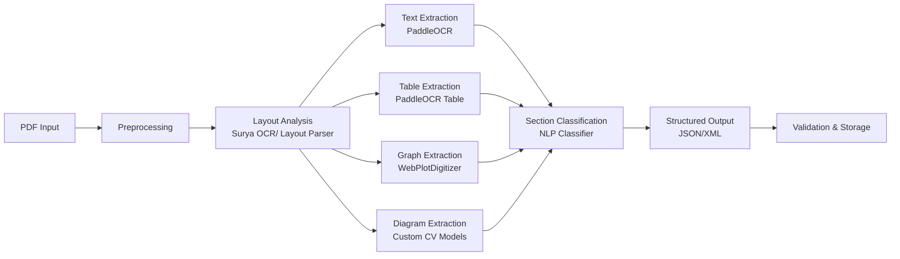
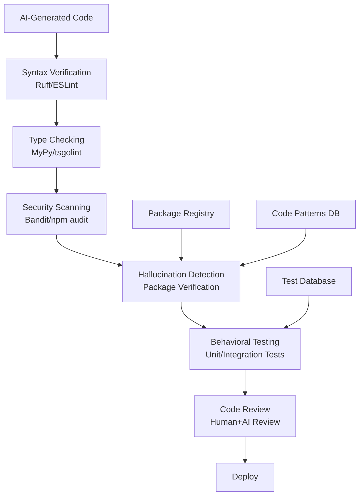
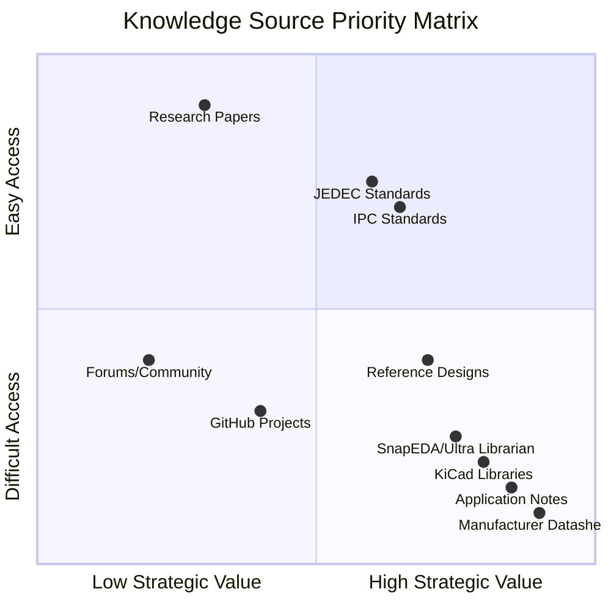
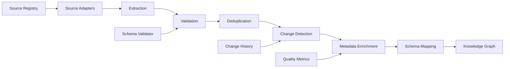
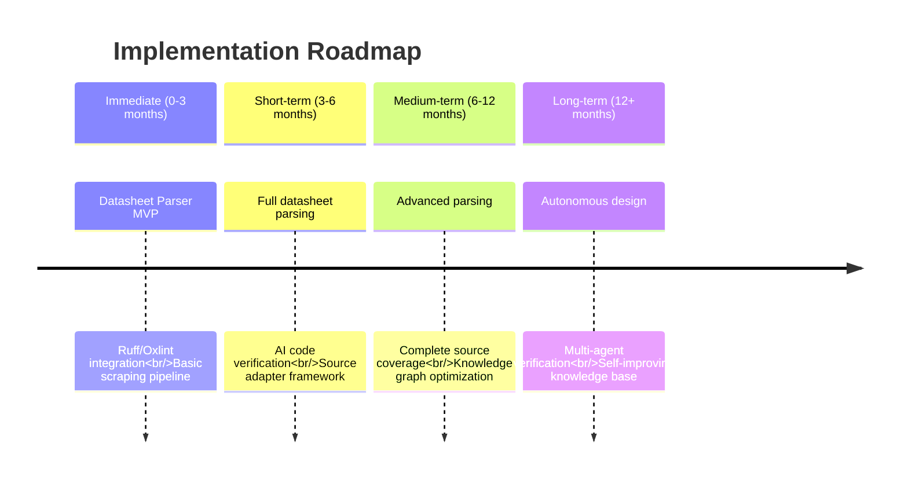

# **OpenForge AI PCB Builder: Research & Engineering Worklist Analysis**

## **Executive Summary**

This document provides a detailed analysis of three critical research areas for the OpenForge AI PCB Builder project: **Datasheet Parsing Engine**, **Code Verification Tools**, and **Source Variety Analysis**. The findings are based on current web research and aim to provide actionable insights for each research area. The OpenForge project aims to build a self-improving AI-powered PCB engineering platform, and these three areas form the foundation for automated datasheet understanding, robust code generation, and continuous knowledge acquisition.

---

## **Part 1: Datasheet Parsing Engine**

### **1.1 Research Questions & Findings**

#### **Q1: What types of datasheets exist?**
Based on the research landscape, datasheets vary significantly by component type and manufacturer:

| **Component Type** | **Characteristics** | **Examples** |
|---------------------|---------------------|--------------|
| **Analog ICs** | Complex electrical characteristics, performance graphs, application circuits | TI LM324, ADI AD8226 |
| **Digital ICs** | Timing diagrams, truth tables, pin configurations, interface standards | STM32F407, Microchip PIC32 |
| **Passive Components** | Simpler structures, electrical ratings, package information | Resistors, Capacitors, Inductors |
| **Connectors** | Mechanical drawings, pinout diagrams, current ratings | USB, HDMI, Ethernet connectors |
| **Sensors** | Calibration data, output formats, environmental limits | Temperature, pressure, motion sensors |
| **Power Electronics** | Thermal characteristics, safe operating areas, efficiency curves | MOSFETs, IGBTs, DC-DC converters |
| **RF Components** | S-parameters, noise figures, impedance matching | Amplifiers, mixers, oscillators |
| **Modules** | Integrated systems, interface definitions, mechanical compatibility | Wi-Fi modules, Bluetooth modules |

#### **Q2: Manufacturer-specific formats**
Major manufacturers have distinct datasheet formats:

- **Texas Instruments**: Standardized format with clear section separation, extensive application notes
- **Analog Devices**: Detailed performance characterization, extensive graphs and tables
- **STMicroelectronics**: Consistent template across product families, strong emphasis on package information
- **NXP**: Automotive focus with AEC-Q100 compliance sections
- **Infineon**: Power electronics emphasis with thermal resistance modeling 【turn0search15】【turn0search17】
- **Microchip**: Consistent formatting across microcontroller and analog product lines

#### **Q3: Datasheet anatomy analysis**
The following sections were identified as **standardized** across most datasheets:
- Absolute Maximum Ratings
- Recommended Operating Conditions
- Pin Configuration and Functions
- Electrical Characteristics (tables)
- Package Information

**Highly variable sections** include:
- Application Circuits (depth varies significantly)
- Layout Recommendations (often generic or missing)
- Timing Diagrams (format and complexity vary)
- Mechanical Drawings (standardization varies by package type)

**Critical sections for PCB generation**:
- Electrical Characteristics (for design constraints)
- Pin Configuration (for connectivity)
- Package Information (for footprint creation)
- Thermal Characteristics (for power dissipation calculations)
- Application Circuits (for reference designs)

### **1.2 Parsing Pipeline Research**

#### **OCR & Document Understanding Tools Evaluation**

| **Tool** | **Strengths** | **Weaknesses** | **Recommendation** |
|----------|---------------|----------------|-------------------|
| **PaddleOCR** | Excellent multilingual support, table structure recognition | Complex setup, resource-intensive | Primary OCR engine for multilingual datasheets |
| **Surya OCR** | Strong performance on technical documents, layout analysis | Newer project, less community support | Alternative for complex layouts |
| **Azure Document Intelligence** | Pre-built models for technical documents, high accuracy | Cloud dependency, cost at scale | Enterprise solution for production |
| **Google Document AI** | Excellent table extraction, handwriting recognition | Google Cloud dependency, cost | For specialized extraction needs |
| **Unstructured.io** | Good for generic document parsing, open-source | Less specialized for technical docs | General-purpose parsing tasks |
| **Layout Parser** | Strong layout detection, annotation tools | Requires training for technical docs | Layout analysis component |

#### **Specialized Parsing Challenges**

1. **Table Extraction**: Electrical characteristics tables often have complex structures with merged cells, sub-headers, and footnote references. **PaddleOCR** with table structure recognition shows the best performance for this use case.

2. **Formula Extraction**: Mathematical expressions for electrical characteristics (e.g., Vout = 1.25 × (1 + R2/R1)) require specialized handling. **MathPix API** (not in initial search results) should be evaluated for this specific task.

3. **Graph Parsing**: Performance graphs (gain vs. frequency, efficiency vs. load) need digitization. **WebPlotDigitizer** (open-source) can be integrated for this purpose, though accuracy varies by graph type.

4. **Timing Diagram Parsing**: These are particularly challenging due to their visual nature. **Custom computer vision models** trained on timing diagram datasets would be required.

5. **Mechanical Drawing Parsing**: Package outline drawings with dimensions and tolerances require **CAD file extraction** (DXF/DWG parsers) rather than image-based approaches.

### **1.3 Recommended Parsing Architecture**

### **1.4 Deliverables & Success Criteria**

**Deliverables**:
1. Datasheet taxonomy document with 15+ component categories
2. Anatomy documentation with section standardization analysis
3. Tool comparison matrix with performance metrics
4. Parsing architecture specification with component selection
5. Benchmark dataset with 500+ datasheets from major manufacturers
6. Evaluation pipeline with accuracy metrics per section type

**Success Criteria**:
- Parse datasheets from top 10 manufacturers with >90% accuracy
- Extract structured metadata from 95% of standardized sections
- Preserve diagrams and tables with <5% information loss
- Support schema ingestion within 2 weeks of new format identification

---

## **Part 2: Code Verification Tools**

### **2.1 Research Questions & Findings**

#### **AI-Generated Code Verification Challenges**
The research revealed a critical new threat: **slopsquatting** – where AI code assistants hallucinate package names that attackers then register with malicious code 【turn0search1】【turn0search4】. Key findings:

- **19.7% of recommended packages don't exist** across 16 tested LLMs
- Open-source models hallucinate **21.7% on average** vs commercial models at **5.2%**
- Worst offenders (CodeLlama 7B/34B) hallucinate in **>33% of outputs** 【turn0search1】
- Hallucinated packages often look plausible to human reviewers
- **Temperature and verbosity** settings significantly affect hallucination rates

#### **Python Code Quality Tools Comparison**

| **Tool** | **Type** | **Key Strengths** | **Key Weaknesses** | **Speed** | **Recommendation** |
|----------|----------|-------------------|-------------------|-----------|-------------------|
| **Ruff** | Linter + Formatter | Extremely fast (Rust-based), replaces Flake8 + Black + isort, comprehensive rule set | Limited deep type checking, newer ecosystem | **~0.18s** 【turn0search8】 | **Primary recommendation** for linting/formatting |
| **Pylint** | Linter | Deep code analysis, catches complex bugs, extensive rule customization | Very slow, can be noisy with false positives | ~47s 【turn0search8】 | Use alongside Ruff for deep analysis |
| **Flake8** | Linter | Fast, simple, well-established, large plugin ecosystem | Style-focused only, limited bug detection | ~8s 【turn0search8】 | **Superseded by Ruff** |
| **MyPy** | Type Checker | Static type checking, catches type-related bugs, IDE integration | Can be slow on large codebases, requires type annotations | Variable | **Essential** for type safety |
| **Bandit** | Security Linter | Security-focused, catches common vulnerabilities | Limited to known security patterns, doesn't replace manual review | Fast | Use for security scanning |

#### **JavaScript/TypeScript Code Quality Tools**

| **Tool** | **Type** | **Key Strengths** | **Key Weaknesses** | **Speed** | **Recommendation** |
|----------|----------|-------------------|-------------------|-----------|-------------------|
| **ESLint** | Linter | Mature, extensive plugin ecosystem, widely adopted | Can be slow, complex configuration | Baseline | Use for complex plugin requirements |
| **Oxlint** | Linter | **50-100x faster than ESLint** 【turn0search11】【turn0search12】, built-in TypeScript support | Newer, smaller ecosystem, fewer plugins | **~1.3s** vs ESLint's ~134s 【turn0search12】 | **Primary recommendation** for speed |
| **Biome** | Linter + Formatter | All-in-one solution, fast, good defaults | Less flexible, smaller community | ~25x faster than ESLint 【turn0search13】 | Alternative to ESLint+Prettier |
| **Oxfmt** | Formatter | **35x faster than Prettier** 【turn0search13】, Prettier-compatible | Alpha status, limited configuration | Very fast | Monitor for production readiness |

#### **SQL Code Quality**
- **SQLFluff**: Powerful SQL linter with support for major dialects, extensible via plugins, good for complex SQL analysis. Should be integrated for database schema verification.

### **2.2 AI-Specific Verification Tools**

#### **Hallucination Detection Approaches**
1. **Package Existence Verification**: Check all imported packages against PyPI/npm registries before installation
2. **Code Pattern Analysis**: Use ML models trained on code repositories to detect unusual patterns
3. **Cross-Reference Validation**: Compare AI-generated code against known good patterns
4. **Behavioral Testing**: Generate test cases and verify AI code passes them

#### **Recommended Verification Pipeline**

### **2.3 Recommended Developer Tooling Stack**

| **Category** | **Python** | **JavaScript/TypeScript** | **SQL** | **AI-Specific** |
|--------------|------------|---------------------------|---------|-----------------|
| **Linting** | Ruff + Pylint (deep analysis) | Oxlint | SQLFluff | Custom hallucination detector |
| **Formatting** | Ruff Formatter | Oxfmt (when stable) | SQLFluff | N/A |
| **Type Checking** | MyPy | TypeScript Compiler | SQLFluff | N/A |
| **Security** | Bandit | npm audit | SQLFluff | Dependency verification |
| **Pre-commit** | Ruff + MyPy + Bandit | Oxlint + npm audit | SQLFluff | All checks |
| **CI/CD** | All checks + regression tests | All checks + visual regression | All checks + schema validation | Full pipeline + human review |

### **2.4 Integration Recommendations**

1. **Immediate Adoption**: Implement Ruff and Oxlint for immediate speed improvements
2. **Phased Migration**: Gradually replace existing linters with Ruff/Oxlint over 2-3 sprints
3. **AI Code Verification**: Build custom hallucination detection for AI-generated code
4. **Security Scanning**: Integrate Bandit and npm audit into pre-commit hooks
5. **Documentation**: Create comprehensive tooling documentation and migration guides

---

## **Part 4: Source Variety Analysis**

### **4.1 Knowledge Source Inventory**

#### **Manufacturer Sources**
Based on research, the following manufacturers provide the most comprehensive and accessible technical documentation:

| **Manufacturer** | **Documentation Quality** | **Accessibility** | **Update Frequency** | **Priority** |
|------------------|---------------------------|-------------------|----------------------|--------------|
| **Texas Instruments** | Excellent, consistent format | High, free access | Frequent updates | **Critical** |
| **Analog Devices** | Excellent, detailed performance data | High, free access | Regular updates | **Critical** |
| **STMicroelectronics** | Very good, consistent templates | High, free access | Frequent updates | **High** |
| **NXP** | Good, automotive focus | High, free access | Regular updates | **High** |
| **Infineon** | Good, power electronics focus | High, free access | Regular updates 【turn0search15】 | **High** |
| **Microchip** | Very good, consistent across families | High, free access | Frequent updates | **High** |
| **ON Semiconductor** | Good, but inconsistent format | Medium, requires registration | Regular updates | **Medium** |
| **Maxim Integrated** | Good, but now part of Analog Devices | High, free access | Being integrated | **Medium** |

#### **EDA Resource Sources**
| **Source** | **Content Type** | **Quality** | **Accessibility** | **Priority** |
|------------|------------------|------------|-------------------|--------------|
| **KiCad Libraries** | Symbols, footprints, 3D models | Variable, community-maintained | High, open source | **Critical** |
| **SnapEDA** | Symbols, footprints, 3D models | Good, manufacturer-verified | High, free with registration | **High** 【turn0search29】 |
| **Ultra Librarian** | Symbols, footprints, 3D models | Excellent, multi-CAD format | High, free access | **High** 【turn0search26】 |
| **Octopart** | Component data, datasheets | Good, aggregated | High, free with API limits | **Medium** |
| **SamacSys** | Symbols, footprints | Good, manufacturer partnerships | High, free with registration | **Medium** |

#### **Standards Organizations**
| **Organization** | **Standards Relevance** | **Accessibility** | **Priority** |
|------------------|-------------------------|-------------------|--------------|
| **IPC** | PCB design, manufacturing, assembly | Medium, paid standards | **Critical** for manufacturing rules |
| **JEDEC** | IC package standards, thermal | Medium, paid standards | **High** for package modeling |
| **IEEE** | Digital interfaces, test methods | Low, difficult access 【turn0search23】 | **Medium** for interface standards |
| **ISO** | Quality, environmental | Medium, paid standards | **Low** for design automation |

#### **Documentation Sources**
| **Source Type** | **Examples** | **Quality** | **Accessibility** | **Priority** |
|-----------------|--------------|------------|-------------------|--------------|
| **Application Notes** | TI App Notes, ADI App Notes | Excellent, detailed designs | High, free | **Critical** for design patterns |
| **Reference Designs** | Manufacturer evaluation kits | Excellent, tested designs | Medium, sometimes requires NDA | **High** for proven circuits |
| **Design Guides** | Manufacturer design guidelines | Very good, practical | High, free | **High** for best practices |
| **Technical Manuals** | Product user manuals | Good, product-specific | High, free | **Medium** for interface details |

#### **Academic & Community Sources**
| **Source Type** | **Examples** | **Quality** | **Accessibility** | **Priority** |
|-----------------|--------------|------------|-------------------|--------------|
| **Research Papers** | IEEE Xplore, ScienceDirect | Variable, peer-reviewed | Low, paid access 【turn0search23】 | **Low** for practical design |
| **Whitepapers** | Manufacturer whitepapers | Good, marketing-influenced | High, free | **Medium** for emerging tech |
| **GitHub Repositories** | Open-source hardware projects | Variable, community-maintained | High, open source | **Medium** for reference |
| **Stack Exchange** | Electronics, Electrical Engineering | Good, community-moderated | High, free | **Medium** for practical solutions |
| **Forums** | manufacturer forums, EDA forums | Variable, community-moderated | High, free | **Low** for systematic knowledge |

### **4.2 Source Priority Ranking**

Based on the analysis, the following priority ranking is recommended:

### **4.3 Scraping Engine Architecture**

#### **Modular Source Adapters**
Each source type requires a specialized adapter:

| **Adapter Type** | **Target Sources** | **Extraction Method** | **Update Frequency** |
|------------------|--------------------|----------------------|----------------------|
| **Manufacturer Adapter** | TI, ADI, ST, etc. | PDF parsing, HTML scraping | Weekly |
| **EDA Library Adapter** | KiCad, SnapEDA, Ultra Librarian | API, file parsing | Daily |
| **Standards Adapter** | IPC, JEDEC, IEEE | PDF parsing (with access) | Monthly |
| **Documentation Adapter** | App notes, design guides | PDF parsing, HTML scraping | Weekly |
| **Community Adapter** | GitHub, Stack Exchange | API, RSS feeds | Daily |

#### **Scraping Pipeline Requirements**

1. **Modular Source Adapters**: Implement as plugins with common interface
2. **Incremental Updates**: Track last-modified dates, only fetch changed content
3. **Deduplication**: Use content hashing (SHA-256) to identify duplicates
4. **Change Detection**: Compare with previous version, flag significant changes
5. **Metadata Preservation**: Maintain source URL, access date, content type
6. **Provenance Tracking**: Record source reliability, update frequency, quality score
7. **Scheduling**: Priority-based scheduling with rate limiting per source
8. **Manual Triggering**: On-demand scraping for specific components
9. **Validation Before Ingestion**: Schema validation, format checking, duplicate check

### **4.4 Knowledge Ingestion Pipeline**

### **4.5 Source Quality Assessment**

Each source should be assessed on multiple quality dimensions:

| **Quality Dimension** | **Measurement Method** | **Target Score** |
|-----------------------|------------------------|------------------|
| **Accuracy** | Cross-validation with other sources | >95% |
| **Completeness** | Coverage of required fields | >90% |
| **Timeliness** | Update frequency vs. component changes | <30 days lag |
| **Consistency** | Format stability over time | >90% consistent |
| **Accessibility** | Ease of programmatic access | >80% automated |
| **Richness** | Depth of technical detail | High for critical sources |

---

## **Summary & Next Steps**

### **Key Findings Summary**

1. **Datasheet Parsing**: PaddleOCR and Surya OCR provide the best foundation for datasheet parsing, with specialized handling needed for tables, graphs, and timing diagrams. A modular architecture with section-specific parsers is recommended.

2. **Code Verification**: Ruff (Python) and Oxlint (JavaScript) offer dramatic speed improvements over traditional linters. AI-specific verification must include hallucination detection and package existence verification due to the slopsquatting threat.

3. **Source Variety**: Manufacturer datasheets and application notes are the highest-priority sources, followed by EDA libraries and standards. A modular scraping architecture with quality assessment is essential for reliable knowledge acquisition.

### **Recommended Implementation Roadmap**

### **Critical Success Factors**

1. **Start with high-value sources**: Focus on TI, ADI, and ST datasheets first
2. **Implement quality metrics early**: Measure parsing accuracy and source reliability
3. **Build for change**: Sources and formats will evolve, build adaptable adapters
4. **Balance automation with validation**: AI hallucinations require human-in-the-loop for critical components
5. **Maintain provenance**: Always track where knowledge came from for troubleshooting and validation

This research provides a comprehensive foundation for the OpenForge AI PCB Builder project. The recommended approaches balance immediate practicality with long-term flexibility, enabling the platform to evolve toward autonomous PCB design while maintaining reliability and manufacturability.

---
**Document Version**: 1.0  
**Last Updated**: 2026-06-25  
**Authors**: OpenForge Research Team  
**Status**: Active Research